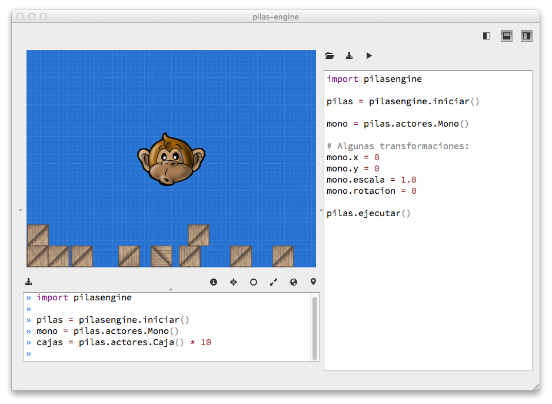

pilas-engine
============

Pilas es un motor para realizar videojuegos de manera rápida y sencilla.

Es una herramienta orientada a programadores casuales o principiantes, es ideal para quienes quieran aprender a realizar sus primeros videojuegos.

## ¿Cómo empezar?

Una buena forma de comenzar con pilas es instalar todo el kit de desarrollo siguiendo las intrucciones de nuestra web:

- http://www.pilas-engine.com.ar

Y una vez instalada la biblioteca, se puede invocar al comando ``pilas -e`` para ver una lista completa de ejemplos y minijuegos.

## Instalación

La forma mas sencilla de instalar pilas en mediante los instaladores
del sitio web:

- http://www.pilas-engine.com.ar/descargas.html

Los instaladores se generan pediodicamente y se distrubuyen para
los sistemas mas utilizados.

### Instalación desde repositorios (Ubuntu, Debian y Mint)

En distribuciones como Ubuntu 12.04 o Linux mint, necesitas instalar
una serie de dependencias:

(en ubuntu 10.04 habilitar la fuente de software "universe" antes)

    sudo apt-get install python-setuptools python-qt4 python-qt4-gl git-core python-qt4-phonon build-essential python-dev swig subversion python-pygame

Luego, instalar box2d:

    sudo easy_install -U box2d

y por último, obtener e instalar pilas desde el respositorio:

    git clone http://github.com/hugoruscitti/pilas

    cd pilas
    python setup.py build
    sudo python setup.py install
    pilasengine

### Instalación en Open Suse 12.2

En el caso de opensuse, los comandos de instalación son:

    sudo zypper install git gcc python-devel swig python-qt4 python-setuptools gcc-c++ python-pygame

    sudo easy_install -U distribute
    sudo easy_install -U box2d

    git clone http://github.com/hugoruscitti/pilas.git

    cd pilas
    git submodule update --init

    python setup.py build
    sudo python setup.py install
    pilas

### Instalación desde Pypi

Primero se deben instalar los siguientes paquetes:

    sudo apt-get install python-setuptools python-qt4 python-qt4-gl git-core python-qt4-phonon build-essential python-dev swig subversion python-pygame

Luego, instalar box2d y pilas usando el comando ``easy_install``:

    sudo easy_install -U box2d
    sudo easy_install -U pilas

## Tests

Nuestros tests se ejecutan en [travis](https://travis-ci.org/hugoruscitti/pilas), aunque
si quieres los puedes ejecutar manualmente en tu equipo con el siguiente comando:

    make utest

## Licencia

Pilas es software libre, y se distribuye bajo la licencia LGPLv3.

Visita nuestro sitio web para obtener mas detalles:

- http://www.pilas-engine.com.ar
